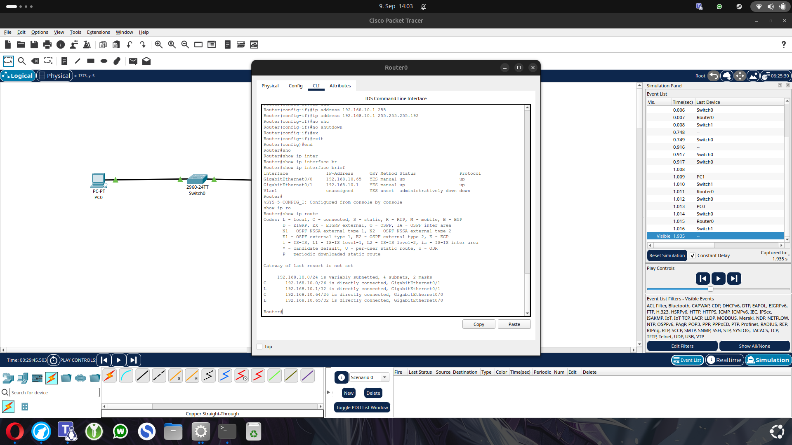
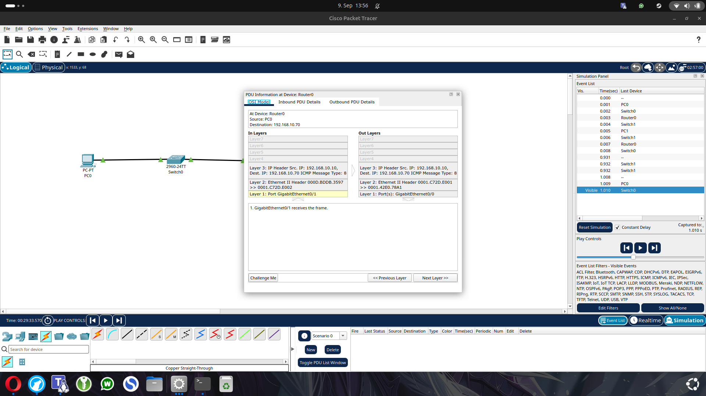

# Lab 02 – Two Subnets with a Router

## Goal

In this lab, I created two separate IPv4 subnets and connected them using a Cisco router.

The goal was to understand:

- how devices communicate inside different subnets
- why a default gateway is required
- how router interfaces are configured
- how a router learns directly connected networks
- how IP addresses stay the same while MAC addresses change between network segments

---

## Topology

The network consists of:

- 2 PCs
- 2 Cisco 2960 switches
- 1 Cisco 1941 router

The topology is:

```text
PC0 ---- Switch0 ---- Router0 ---- Switch1 ---- PC1
```

The router connects the two different IPv4 networks.

---

## IPv4 Addressing

### LAN 1

Network:

```text
192.168.10.0/26
```

Address range:

```text
Network address:   192.168.10.0
Usable hosts:      192.168.10.1 - 192.168.10.62
Broadcast address: 192.168.10.63
```

PC0:

```text
IP address:      192.168.10.10
Subnet mask:     255.255.255.192
Default gateway: 192.168.10.1
```

Router interface:

```text
GigabitEthernet0/1
IP: 192.168.10.1/26
```

---

### LAN 2

Network:

```text
192.168.10.64/26
```

Address range:

```text
Network address:   192.168.10.64
Usable hosts:      192.168.10.65 - 192.168.10.126
Broadcast address: 192.168.10.127
```

PC1:

```text
IP address:      192.168.10.70
Subnet mask:     255.255.255.192
Default gateway: 192.168.10.65
```

Router interface:

```text
GigabitEthernet0/0
IP: 192.168.10.65/26
```
---

## Building the Topology

I added the following devices in Cisco Packet Tracer:

- PC0
- PC1
- Switch0 – Cisco 2960-24TT
- Switch1 – Cisco 2960-24TT
- Router0 – Cisco 1941

I connected all devices using Copper Straight-Through cables.

The important router connections are:

```text
LAN 1 / PC0 side → Router0 GigabitEthernet0/1
LAN 2 / PC1 side → Router0 GigabitEthernet0/0
```

The final path is:

```text
PC0
 |
Switch0
 |
GigabitEthernet0/1
 |
Router0
 |
GigabitEthernet0/0
 |
Switch1
 |
PC1
```

---

## Configuring the PCs

The PCs were configured manually through:

```text
PC → Desktop → IP Configuration
```

### PC0

```text
IP Address:      192.168.10.10
Subnet Mask:     255.255.255.192
Default Gateway: 192.168.10.1
```

PC0 belongs to the network:

```text
192.168.10.0/26
```

Its default gateway is the router interface connected to the same network.

### PC1

```text
IP Address:      192.168.10.70
Subnet Mask:     255.255.255.192
Default Gateway: 192.168.10.65
```

PC1 belongs to the network:

```text
192.168.10.64/26
```

Its default gateway is the router interface connected to its own network.

The two PCs therefore use different default gateways even though both gateways belong to the same physical router.

---

## Configuring Router0 with the CLI

The router interfaces were configured using the Cisco IOS CLI.

### Enter privileged EXEC mode

```text
enable
```

`enable` changes from normal user mode:

```text
Router>
```

to privileged EXEC mode:

```text
Router#
```

Privileged mode allows administrative and diagnostic commands.

### Enter global configuration mode

```text
configure terminal
```

The prompt changes to:

```text
Router(config)#
```

Global configuration mode is used to change the router configuration.

---

### Configure GigabitEthernet0/1

This interface connects Router0 to LAN 1.

```text
interface gigabitEthernet 0/1
ip address 192.168.10.1 255.255.255.192
no shutdown
exit
```

The commands mean:

```text
interface gigabitEthernet 0/1
```

Selects the physical interface that I want to configure.

```text
ip address 192.168.10.1 255.255.255.192
```

Assigns the IPv4 address and subnet mask to the interface.

This address becomes the default gateway for PC0.

```text
no shutdown
```

Enables the interface.

Cisco router interfaces can be administratively disabled by default. `no shutdown` turns the interface on.

```text
exit
```

Leaves interface configuration mode and returns to global configuration mode.

---

### Configure GigabitEthernet0/0

This interface connects Router0 to LAN 2.

```text
interface gigabitEthernet 0/0
ip address 192.168.10.65 255.255.255.192
no shutdown
exit
```

The address `192.168.10.65` belongs to the second subnet:

```text
192.168.10.64/26
```

This router interface becomes the default gateway for PC1.

---

## Why the Router Needs Two IP Addresses

A router connects different IP networks.

Each router interface must therefore have an IP address that belongs to the network connected to that interface.

In this lab:

```text
G0/1 → 192.168.10.1/26
       belongs to 192.168.10.0/26

G0/0 → 192.168.10.65/26
       belongs to 192.168.10.64/26
```

This allows Router0 to communicate directly with devices in both networks.

---

## Verifying the Router Configuration

After configuring both router interfaces, I checked their status with:

```text
show ip interface brief
```

The important output was:

```text
Interface              IP-Address       Status   Protocol
GigabitEthernet0/0     192.168.10.65    up       up
GigabitEthernet0/1     192.168.10.1     up       up
```

`up / up` means that:

- the physical interface is active
- the line protocol is working

This confirms that both router interfaces are operational.



---

## Checking the Routing Table

I then used:

```text
show ip route
```

The router automatically learned both networks because they are directly connected to its interfaces.

The important routes were:

```text
C 192.168.10.0/26 is directly connected, GigabitEthernet0/1
L 192.168.10.1/32 is directly connected, GigabitEthernet0/1

C 192.168.10.64/26 is directly connected, GigabitEthernet0/0
L 192.168.10.65/32 is directly connected, GigabitEthernet0/0
```

### Meaning of the route codes

`C` means **Connected**.

The router knows this network because one of its interfaces is directly connected to it.

`L` means **Local**.

This represents the exact IPv4 address configured on the router interface itself.

For example:

```text
C 192.168.10.0/26
```

means Router0 can reach the complete first subnet through `GigabitEthernet0/1`.

```text
L 192.168.10.1/32
```

represents Router0's own interface address.

The same applies to the second subnet on `GigabitEthernet0/0`.

The routing table also showed:

```text
Gateway of last resort is not set
```

This means the router currently has no default route.

That is not a problem in this lab because both networks we want to reach are directly connected to Router0.

---

## Testing Connectivity

After configuring the router and both PCs, I tested the connection with `ping`.

First, PC0 tested its own default gateway:

```text
ping 192.168.10.1
```

This confirmed that PC0 could reach Router0 on the first subnet.

Then PC0 tested PC1:

```text
ping 192.168.10.70
```

The ping was successful.

This proves that Router0 can route traffic between:

```text
192.168.10.0/26
```

and:

```text
192.168.10.64/26
```

`ping` uses ICMP.

ICMP stands for:

```text
Internet Control Message Protocol
```

When PC0 sends traffic to PC1, the destination is in another subnet, so PC0 sends the frame to its default gateway first.

The router then forwards the packet into the second subnet.

---

## Inspecting the Packet in Simulation Mode

To understand what happens when a packet crosses the router, I used Cisco Packet Tracer Simulation Mode.

I filtered the events and focused on ICMP traffic.

ICMP stands for:

```text
Internet Control Message Protocol
```

When PC0 sends a ping to PC1, the IPv4 addresses remain the same:

```text
Source IP:      192.168.10.10
Destination IP: 192.168.10.70
```

These addresses stay the same while the packet travels through the router.

However, the MAC addresses change at the router.

On the first network segment:

```text
Source MAC:      PC0 MAC
Destination MAC: Router0 G0/1 MAC
```

On the second network segment:

```text
Source MAC:      Router0 G0/0 MAC
Destination MAC: PC1 MAC
```

This happens because the router removes the old Ethernet frame and creates a new Ethernet frame for the next network segment.

The important rule is:

```text
IP addresses  = end-to-end
MAC addresses = hop-to-hop
```



This confirms that routers forward packets between networks while rebuilding the Layer 2 frame for each network segment.


---

## Troubleshooting Lesson

During the lab, the router interfaces were initially assigned to the wrong physical sides.

The interfaces were both `up/up`, but the IP addresses did not match the networks connected to them.

The fix was:

```text
G0/1 → 192.168.10.1/26
G0/0 → 192.168.10.65/26
```

This showed that an interface can be active but still be configured for the wrong subnet.

A useful troubleshooting command is:

```text
show ip interface brief
```

It helps verify the interface IP addresses and whether the interfaces are `up/up`.

---

## Final Result

The lab successfully connected two different `/26` IPv4 networks through one router.

I practiced:

- subnetting with `/26`
- configuring default gateways
- configuring Cisco router interfaces
- using `show ip interface brief`
- using `show ip route`
- testing connectivity with ICMP
- understanding that IP addresses stay end-to-end while MAC addresses change hop-to-hop

The final network communication between PC0 and PC1 worked successfully.